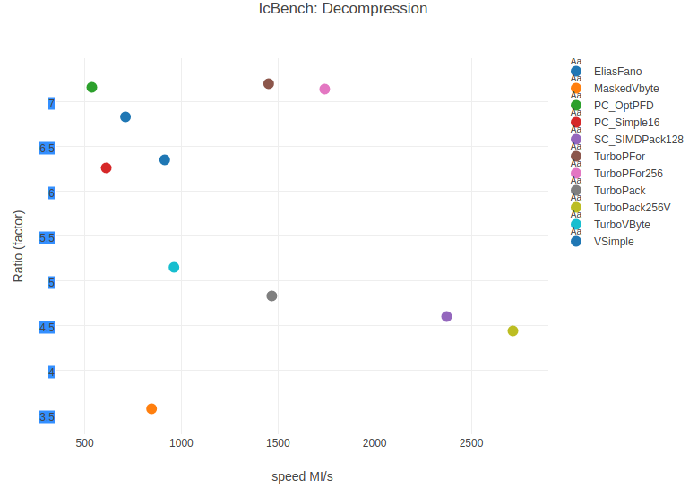

TurboPFor: Fastest Integer Compression 
======================================
+ **TurboPFor: The new synonym for "integer compression"**
 - 100% C (C++ compatible headers), w/o inline assembly
 - Usage as simple as memcpy
 - :+1: **Java** Critical Native Interface. Access TurboPFor **incl. SIMD!** from Java as fast as calling from C
 - :sparkles: **FULL** range 16/32/64 bits integer lists and Floating point
 - No other "Integer Compression" compress or decompress faster with better compression
 - Direct Access is several times faster than other libraries
 - :sparkles: Integrated (SIMD) differential/Zigzag encoding/decoding for sorted/unsorted integer lists
 - Compress better and faster than special binary compressors like blosc

+ **For/PFor/PForDelta**
 - **Novel** **"TurboPFor"** (Patched Frame-of-Reference,PFor/PForDelta) scheme with **direct access** or bulk decoding.
  Outstanding compression and speed. More efficient than **ANY** other fast "integer compression" scheme.
 - Compress 70 times faster and decompress up to 4 times faster than OptPFD
 - :new: **(2017) TurboPFor AVX2, now 50%! more faster!!!!**
 - :new: **(2017) TurboPFor Hybrid, better compression and more faster**

+ **Bit Packing**
 - :sparkles: Fastest and most efficient **"SIMD Bit Packing"**
 - :new: **(2017) TurboPack AVX2, now more faster. Decoding 10 Billions intergers/seconds**
 - Scalar **"Bit Packing"** decoding as fast as SIMD-Packing in realistic (No "pure cache") scenarios
 - Bit Packing with **Direct/Random Access** without decompressing entire blocks
 - Access any single bit packed entry with **zero decompression**
 - :sparkles: **Direct Update** of individual bit packed entries
 - Reducing **Cache Pollution**

+ **Variable byte**
 - :sparkles: Scalar **"Variable Byte"** faster and more efficient than **ANY** other (incl. SIMD MaskedVByte) implementation
 - :new: **(2017) new scheme w. better compression and 30% more faster**

+ **Simple family**
 - :sparkles: **Novel** **"Variable Simple"** (incl. **RLE**) faster and more efficient than simple16, simple-8b
   or other "simple family" implementation

+ **Elias fano**
 - :sparkles: Fastest **"Elias Fano"** implementation w/ or w/o SIMD

+ **Transform**
 - :sparkles: Scalar & SIMD Transform: Delta, Zigzag, Transpose/Shuffle, Floating point<->Integer

+ **Inverted Index ...do less, go fast!**
 - Direct Access to compressed *frequency* and *position* data in inverted index with zero decompression
 - :sparkles: **Novel** **"Intersection w/ skip intervals"**, decompress the minimum necessary blocks (~10-15%)!. 
 - **Novel** Implicit skips with zero extra overhead
 - **Novel** Efficient **Bidirectional** Inverted Index Architecture (forward/backwards traversal) incl. "integer compression".
 - more than **2000! queries per second** on GOV2 dataset (25 millions documents) on a **SINGLE** core
 - :sparkles: Revolutionary Parallel Query Processing on Multicores w/ more than **7000!!! queries/sec** on a quad core PC. 
   **...forget** ~~Map Reduce, Hadoop, multi-node clusters,~~ ...
   
### Integer Compression Benchmark:
- Realistic and practical "integer compression" benchmark with **large** integer arrays.
- No **PURE** cache benchmark

##### - Synthetic data (2017): 
 - Generate and test (zipfian) skewed distribution (100.000.000 integers, Block size=128/256) 
   Note: Unlike general purpose compression, a small fixed size (ex. 128 integers) is in general used in "integer compression".
   Large blocks involved, while processing queries (inverted index, search engines, databases, graphs, in memory computing,...) need to be entirely decoded

        ./icbench -a1.5 -m0 -M255 -n100M ZIPF
	
CPU: Skylake i7-6700 w/ only 3.7GHz gcc 6.2 single thread 

|C Size|ratio%|Bits/Integer|C MI/s|D MI/s|Name|
|--------:|-----:|--------:|----------:|----------:|--------------|
|62939886| 15.7| 5.04|**397**|**2311**|**TurboPFor256**|
|63392759| 15.8| 5.07|330|1608|**TurboPFor**|
|63392801| 15.8| 5.07|326|231|**TurboPForDA**|
|65060504| 16.3| 5.20|15|687|[FP.SIMDOptPFor](#FastPFor)|
|65359916|16.3| 5.23| 8| 609|PC.OptPFD|
|73477088|18.4| 5.88|102| 621|PC.Simple16|
|73481096| 18.4| 5.88|156|2187|[FP.SimdFastPFor](#FastPFor) 64k *|
|76345136| 19.1| 6.11|245|653|**VSimple**|
|91956582| 25.5| 8.15|65|2141|[QMX](#QMX) 64k *|
|95915096|24.0| 7.67|  212|958|Simple-8b|
|99910930| 25.0| 7.99|**3290**|**2968**|**TurboPackV**|
|99910930| 25.0| 7.99|2122|2347|**TurboPack**|
|99910930| 25.0| 7.99|2105|2219|**TurboFor**|
|100332929| 25.1| 8.03|**3580**|**2998**|**TurboPack256V**|
|101015650| 25.3| 8.08|2380|2371|**TurboVByte**|
|102074663| 25.5| 8.17|1428|1979|[MaskedVByte](#MaskedVByte)|
|102074663| 25.5| 8.17|565|1052|[PC.Vbyte](#PolyCom)|
|102083036| 25.5| 8.17|1300|1067|[FP.VByte](#FastPFor)|
|112500000| 28.1| 9.00|382|**3035**|[VarintG8IU](#VarintG8IU)|
|125000000| 31.2|10.00|1111|2948|[StreamVbyte](#StreamVByte)|
|400000000|	100.00|	32.00| 2240|2237|Copy|
|         |      |     |   N/A  | N/A   |EliasFano|

(*) optimzed for large block size

MI/s: 1.000.000 integers/second. **1000 MI/s = 4 GB/s**  
**#BOLD** = pareto frontier. 
FP=FastPFor SC:simdcomp PC:Polycom 
TurboPForDA,TurboForDA: Direct Access is normally used when accessing few individual values.

------------------------------------------------------------------------
##### - Data files:
 - gov2.sorted from [DocId data set](#DocId data set) Block size=128 (lz4+blosc+VSimple w/ 64Ki)
------------------------------------------------------------------------

------------------------------------------------------------------------

        ./icbench -fS -r gov2.sorted

|Size |Ratio %|Bits/Integer|C Time MI/s|D Time MI/s|Function |
|-----------:|------:|-----:|-------:|-------:|---------------------|
| 3.321.663.893| 13.9| 4.44|**328**|**1452**|**TurboPFor**| 
| 3.339.730.557| 14.0| 4.47|   8| 536|PC.OptPFD|
| 3.350.717.959| 14.0| 4.48|**365**|**1744**|**TurboPFor256**| 
| 3.501.671.314| 14.6| 4.68| 314| 710|**VSimple**|
| 3.768.146.467| 15.8| 5.04|**807**| 913|**EliasFanoV**|
| 3.822.161.885| 16.0| 5.11| 143| 611|PC.Simple16|
| 4.521.326.518| 18.9| 6.05| 209| 824|Simple-8b|
| 4.649.671.427| 19.4| 6.22|771|962|**TurboVbyte**|
| 4.953.768.342| 20.7| 6.63|1397|1467|**TurboPack**|
| 4.955.740.045| 20.7| 6.63|**1766**|**2567**|**TurboPackV**|
| 5.205.324.760|21.8| 6.96|1738|2372|SC.SIMDPack128|
| 5.393.769.503| 22.5| 7.21|**2261**|**2715**|**TurboPackV256**|
| 6.221.886.390| 26.0| 8.32|1667|1738|**TurboFor**|
| 6.221.886.390| 26.0| 8.32|1661| 565|**TurboForDA**|
| 6.699.519.000| 28.0| 8.96| 472| 495|FP.Vbyte|
| 6.700.989.563| 28.0| 8.96| 685| 846|MaskedVByte|
| 7.622.896.878| 31.9|10.20| 209|1198|VarintG8IU|
| 8.594.342.216| 35.9|11.50|1307|1594|libfor|
|23.918.861.764|100.0|32.00|1456|1481|Copy|

|Size |Ratio %|Bits/Integer|C Time MI/s|D Time MI/s|Function |
|----------:|-----:|----:|------:|------:|---------------------|
| 3.214.763.689| 13.44| 4.30| 339.90| 837.69|**VSimple 64Ki**|
| 3.958.888.197| 16.55| 5.30| 279.19| 618.60|[lz4](#lz4)+DT 64Ki|
| 6.074.995.117| 25.40| 8.13| 494.70| 729.97|[blosc_lz4](#blosc) 64Ki| 
| 8.773.150.644| 36.68|11.74| 637.83|1301.05|blosc_lz 64Ki|

Ki=1024 Integers. 64Ki = 256k bytes 
"lz4+DT 64Ki" = Delta+Transpose from TurboPFor + lz4 
"blosc_lz4" tested w/ lz4 compressor+vectorized shuffle

##### - Compressed Inverted Index Intersections with GOV2 
   GOV2: 426GB, 25 Millions documents, average doc. size=18k.

   + Aol query log: 18.000 queries 
     **~1300** queries per second (single core) 
     **~5000** queries per second (quad core) 
     Ratio = 14.37% Decoded/Total Integers.

   + TREC Million Query Track (1MQT): 
     **~1100** queries per second (Single core)  
     **~4500** queries per second (Quad core CPU) 
     Ratio = 11.59% Decoded/Total Integers.

- Benchmarking intersections (Single core, AOL query log)

| max.docid/q|Time s| q/s | ms/q | % docid found|
|-----------------:|---:|----:|-----:|-------:|
|1.000|7.88|2283.1|0.438|81|
|10.000|10.54|1708.5|0.585|84|
| ALL |13.96|1289.0|0.776|100|
q/s: queries/second, ms/q:milliseconds/query

- Benchmarking Parallel Query Processing (Quad core, AOL query log)

| max.docid/q|Time s| q/s | ms/q | % docids found|
|-----------------:|----:|----:|-----:|-------:|
|1.000|2.66|6772.6|0.148|81|
|10.000|3.39|5307.5|0.188|84|
|ALL|3.57|5036.5|0.199|100|

###### Notes:
- Search engines are spending 90% of the time in intersections when processing queries. 
- Most search engines are using pruning strategies, caching popular queries,... to reduce the time for intersections and query processing.
- As indication, google is processing [40.000 Queries per seconds](http://www.internetlivestats.com/google-search-statistics/),
using [900.000 multicore servers](https://www.cloudyn.com/blog/10-facts-didnt-know-server-farms/) for searching [8 billions web pages](http://searchenginewatch.com/sew/study/2063479/coincidentally-googles-index-size-jumps) (320 X size of GOV2).
- Recent "integer compression" GOV2 experiments (best paper at ECIR 2014) [On Inverted Index Compression for Search Engine Efficiency](http://www.dcs.gla.ac.uk/~craigm/publications/catena14compression.pdf) using 8-core Xeon PC are reporting 1.2 seconds per query (for 1.000 Top-k docids).

### Compile:

  		git clone --recursive git://github.com/powturbo/TurboPFor.git
        cd TurboPFor
  		make

  		or

  		make AVX2=1

### Testing:
##### - Synthetic data (use ZIPF parameter):
  + benchmark groups of "integer compression" functions  

        ./icbench -eBENCH -a1.2 -m0 -M255 -n100M ZIPF
        ./icbench -eBITPACK/VBYTE -a1.2 -m0 -M255 -n100M ZIPF

   >*Type "icbench -l1" for a list*

   >*-zipfian distribution alpha = 1.2 (Ex. -a1.0=uniform -a1.5=skewed distribution) 
     -number of integers = 100.000.000 
     -integer range from 0 to 255 *
  
  + individual function test (ex. Copy TurboPack TurboPFor) 

        ./icbench -a1.5 -m0 -M255 -ecopy/turbopack/turbopfor/turbopack256v ZIPF

##### - Data files:
  - Raw 32 bits binary data file (see option "-f" for other formats)

        ./icbench file

  - Multiblock sorted (unique) data file like gov2 file from [DocId data set](#DocId data set)

        ./icbench -fS -r gov2.sorted

##### - Intersections:
  1 - Download Gov2 (or ClueWeb09) + query files (Ex. "1mq.txt") from [DocId data set](#DocId data set) 
   8GB RAM required (16GB recommended for benchmarking "clueweb09" files).

  2 - Create index file

        ./idxcr gov2.sorted .

   >*create inverted index file "gov2.sorted.i" in the current directory*

  3 - Test intersections

        ./idxqry gov2.sorted.i 1mq.txt

  >*run queries in file "1mq.txt" over the index of gov2 file*

##### - Parallel Query Processing:
  1 - Create partitions

  
        ./idxseg gov2.sorted . -26m -s8

  
 >*create 8 (CPU hardware threads) partitions for a total of ~26 millions document ids*
  
  2 - Create index file for each partition

      ./idxcr gov2.sorted.s*

  >*create inverted index file for all partitions "gov2.sorted.s00 - gov2.sorted.s07" in the current directory*

  3 - Intersections:
  
  delete "idxqry.o" file and then type "make para" to compile "idxqry" w. multithreading

      ./idxqry gov2.sorted.s*.i 1mq.txt

  >*run queries in file "1mq.txt" over the index of all gov2 partitions "gov2.sorted.s00.i - gov2.sorted.s07.i".*

### Function usage:
See benchmark "icbench" program for "integer compression" usage examples.
In general encoding/decoding functions are of the form:

  >**char *endptr = encode( unsigned *in, unsigned n, char *out, [unsigned start], [int b])** 
  endptr : set by encode to the next character in "out" after the encoded buffer 
  in     : input integer array 
  n      : number of elements 
  out    : pointer to output buffer 
  b      : number of bits. Only for bit packing functions 
  start  : previous value. Only for integrated delta encoding functions

   
  >**char *endptr = decode( char *in, unsigned n, unsigned *out, [unsigned start], [int b])** 
  endptr : set by decode to the next character in "in" after the decoded buffer 
  in     : pointer to input buffer 
  n      : number of elements 
  out    : output integer array 
  b      : number of bits. Only for bit unpacking functions 
  start  : previous value. Only for integrated delta decoding functions

header files to use with documentation: 

| header file|Integer Compression functions|
|------------|-----------------------------|
|vint.h|variable byte|
|vsimple.h|variable simple|
|vp4c.h, vp4d.h|TurboPFor|
|bitpack.h bitunpack.h|Bit Packing, For, +Direct Access|
|eliasfano.h|Elias Fano|

### Environment:
###### OS/Compiler (64 bits):
- Linux: GNU GCC (>=4.6)
- clang (>=3.2)
- Windows: MinGW-w64 (no parallel query processing)

###### Multithreading:
- All TurboPFor integer compression functions are thread safe

### References:

 + [FastPFor](https://github.com/lemire/FastPFor) + [Simdcomp](https://github.com/lemire/simdcomp): SIMDPack FPF, Vbyte FPF, VarintG8IU, StreamVbyte
 + [Optimized Pfor-delta compression code](http://jinruhe.com): OptPFD/OptP4, Simple16 (limited to 28 bits integers)
 + [MaskedVByte](http://maskedvbyte.org/). See also: [Vectorized VByte Decoding](http://engineering.indeed.com/blog/2015/03/vectorized-vbyte-decoding-high-performance-vector-instructions/)
 + [Streamvbyte](https://github.com/lemire/streamvbyte). 
 + [Index Compression Using 64-Bit Words](http://people.eng.unimelb.edu.au/ammoffat/abstracts/am10spe.html): Simple-8b (speed optimized version tested)
 + [libfor](https://github.com/cruppstahl/for)
 + [Compression, SIMD, and Postings Lists](http://www.cs.otago.ac.nz/homepages/andrew/papers/) QMX integer compression from the "simple family"
 + [lz4](https://github.com/Cyan4973/lz4). included w. block size 64K as indication. Tested after preprocessing w. delta+transpose
 + [blosc](https://github.com/Blosc/c-blosc). blosc is like transpose/shuffle+lz77. Tested blosc+lz4 and blosclz incl. vectorizeed shuffle. 
 + [Document identifier data set](http://lemire.me/data/integercompression2014.html)

 + **Integer compression publications:**
   - [In Vacuo and In Situ Evaluation of SIMD Codecs (TurboPackV,TurboPFor/QMX)](http://dl.acm.org/citation.cfm?id=3015023) + [paper](http://www.cs.otago.ac.nz/homepages/andrew/papers/)
   - [SIMD Compression and the Intersection of Sorted Integers](http://arxiv.org/abs/1401.6399)
   - [Partitioned Elias-Fano Indexes](http://www.di.unipi.it/~ottavian/files/elias_fano_sigir14.pdf)
   - [On Inverted Index Compression for Search Engine Efficiency](http://www.dcs.gla.ac.uk/~craigm/publications/catena14compression.pdf)
   - [Google's Group Varint Encoding](http://static.googleusercontent.com/media/research.google.com/de//people/jeff/WSDM09-keynote.pdf)

 + **Applications:**
   - [Graph500](https://github.com/julianromera/graph500)
   - [Small Polygon Compression](https://arxiv.org/abs/1509.05505) + [Poster](http://abhinavjauhri.me/publications/dcc_poster_2016.pdf) + [code](https://github.com/ajauhri/bignum_compression)
   - [Parallel Graph Analysis (Lecture 18)](http://www.cs.rpi.edu/~slotag/classes/FA16/) + [code](http://www.cs.rpi.edu/~slotag/classes/FA16/handson/lec18-comp2.cpp)

Last update:  04 JAN 2017
