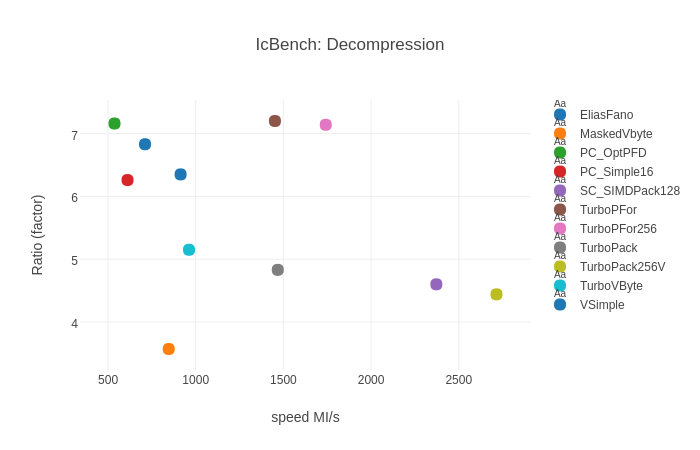

TurboPFor: Fastest Integer Compression 
======================================
* **TurboPFor: The new synonym for "integer compression"**
  * 100% C (C++ headers), as simple as memcpy
  * :+1: **Java** Critical Natives/JNI. Access TurboPFor **incl. SIMD/AVX2!** from Java as fast as calling from C
  * :sparkles: **FULL** range 8/16/32/64 bits scalar + 16/32/64 bits SIMD functions
  * No other "Integer Compression" compress/decompress faster
  * :sparkles: Direct Access, **integrated** (SIMD/AVX2) FOR/delta/Delta of Delta/Zigzag for sorted/unsorted arrays
  * :new: **16 bits** + **64 bits** SIMD integrated functions
* **For/PFor/PForDelta**
  * **Novel TurboPFor** (PFor/PForDelta) scheme w./ **direct access** + **SIMD/AVX2**.
  * Outstanding compression/speed. More efficient than **ANY** other fast "integer compression" scheme.
  * Compress 70 times faster and decompress up to 4 times faster than OptPFD
* **Bit Packing**
  * Fastest and most efficient **"SIMD Bit Packing"** **10 Billions integers/sec (40Gb/s!)**
  * Scalar **"Bit Packing"** decoding nearly as fast as SIMD-Packing in realistic (No "pure cache") scenarios
  * **Direct/Random Access** : Access any single bit packed entry with **zero decompression**
* **Variable byte**
  * Scalar **"Variable Byte"** faster than **ANY** other (incl. SIMD) implementation
* **Simple family**
  * **Novel** **"Variable Simple"** (incl. **RLE**) faster and more efficient than simple16, simple-8b
* **Elias fano**
  * Fastest **"Elias Fano"** implementation w/ or w/o SIMD/AVX2
+ **Transform**
  * Scalar & SIMD Transform: Delta, Zigzag, Transpose/Shuffle
* **Floating Point Compression**
  * Delta/Delta of delta + (Differential) Finite Context Method FCM/DFCM floating point compression
  * Using **TurboPFor**, unsurpassed compression and more than 5 GB/s throughput
* :new: **Time Series Compression**
  * **Fastest Gorilla** style compression (:new: incl. **RLE**) with **variable byte** or **bit/io**.
  * Full range 32/64 bits, better compression. > 10 GB/s compression and > 13 GB/s decompression
* **Inverted Index ...do less, go fast!**
  * Direct Access to compressed *frequency* and *position* data w/ zero decompression
  * **Novel** **"Intersection w/ skip intervals"**, decompress the minimum necessary blocks (**~10-15%)!**. 
  * **Novel** Implicit skips with zero extra overhead
  * **Novel** Efficient **Bidirectional** Inverted Index Architecture (forward/backwards traversal) incl. "integer compression".
  * more than **2000! queries per second** on GOV2 dataset (25 millions documents) on a **SINGLE** core
  * :sparkles: Revolutionary Parallel Query Processing on Multicores **> 7000!!! queries/sec** on a simple quad core PC. 
   **...forget** ~~Map Reduce, Hadoop, multi-node clusters,~~ ...
   
### Integer Compression Benchmark:
- Practical (No **PURE** cache) "integer compression" benchmark w/ **large** arrays.
- CPU: Skylake i7-6700 3.4GHz gcc 7.2 **single** thread 

##### - Synthetic data:
 - Generate and test (zipfian) skewed distribution (100.000.000 integers, Block size=128/256) 
   Note: Unlike general purpose compression, a small fixed size (ex. 128 integers) is in general used in "integer compression".
   Large blocks involved, while processing queries (inverted index, search engines, databases, graphs, in memory computing,...) need to be entirely decoded.

        ./icbench -a1.5 -m0 -M255 -n100M ZIPF
	
|C Size|ratio%|Bits/Integer|C MB/s|D MB/s|Name|
|--------:|-----:|--------:|----------:|----------:|--------------|
|62939886| 15.7| 5.04|**1588**|**9400**|**TurboPFor256**|
|63392759| 15.8| 5.07|1320|6432|**TurboPFor**|
|63392801| 15.8| 5.07|1328|924|**TurboPForDA**|
|65060504| 16.3| 5.20|60|2748|[FP_SIMDOptPFor](#FastPFor)|
|65359916|16.3| 5.23| 32|2436|PC_OptPFD|
|73477088|18.4| 5.88|408|2484|PC_Simple16|
|73481096| 18.4| 5.88|624|8748|[FP_SimdFastPFor](#FastPFor) 64Ki *|
|76345136| 19.1| 6.11|980|2612|**VSimple**|
|91947533| 23.0| 7.36|284|11737|[QMX](#QMX) 64k *|
|93285864| 23.3| 7.46|1568|10232|[FP_GroupSimple](#FastPFor) 64Ki *|
|95915096|24.0| 7.67|  848|3832|Simple-8b|
|99910930| 25.0| 7.99|**13976**|**11872**|**TurboPackV**|
|99910930| 25.0| 7.99|9468|9404|**TurboPack**|
|99910930| 25.0| 7.99|8420|8876|**TurboFor**|
|100332929| 25.1| 8.03|**14320**|**12124**|**TurboPack256V**|
|101015650| 25.3| 8.08|9520|9484|**TurboVByte**|
|102074663| 25.5| 8.17|5712|7916|[MaskedVByte](#MaskedVByte)|
|102074663| 25.5| 8.17|2260|4208|[PC_Vbyte](#PolyCom)|
|102083036| 25.5| 8.17|5200|4268|[FP_VByte](#FastPFor)|
|112500000| 28.1| 9.00|1528|**12140**|[VarintG8IU](#VarintG8IU)|
|125000000| 31.2|10.00|4788|11288|[StreamVbyte](#StreamVByte)|
|400000000|	100.00|	32.00| 8960|8948|Copy|
|         |      |     |   N/A  | N/A   |EliasFano|

(*) codecs inefficient for small block sizes are tested with 64Ki integers/block.

- MB/s: 1.000.000 bytes/second. **1000 MB/s = 1 GB/s**  
- **#BOLD** = pareto frontier. 
- FP=FastPFor SC:simdcomp PC:Polycom 
- TurboPForDA,TurboForDA: Direct Access is normally used when accessing few individual values. 
- Eliasfano can be directly used only for increasing sequences
------------------------------------------------------------------------
##### - Data files:
 - gov2.sorted from [DocId data set](#DocId) Block size=128/Delta coding

        ./icbench -fS -r gov2.sorted

|Size |Ratio %|Bits/Integer|C Time MB/s|D Time MB/s|Function |
|-----------:|------:|-----:|-------:|-------:|---------------------|
| 3.321.663.893| 13.9| 4.44|**1320**|**6088**|**TurboPFor**| 
| 3.339.730.557| 14.0| 4.47|  32| 2144|PC.OptPFD|
| 3.350.717.959| 14.0| 4.48|**1536**|**7128**|**TurboPFor256**| 
| 3.501.671.314| 14.6| 4.68| 56| 2840|**VSimple**|
| 3.768.146.467| 15.8| 5.04|**3228**| 3652|**EliasFanoV**|
| 3.822.161.885| 16.0| 5.11| 572| 2444|PC_Simple16|
| 4.521.326.518| 18.9| 6.05| 836| 3296|Simple-8b|
| 4.649.671.427| 19.4| 6.22|3084|3848|**TurboVbyte**|
| 4.955.740.045| 20.7| 6.63|**7064**|**10268**|**TurboPackV**|
| 4.955.740.045| 20.7| 6.63|5724|8020|**TurboPack**|
| 5.205.324.760|21.8| 6.96|6952|9488|SC_SIMDPack128|
| 5.393.769.503| 22.5| 7.21|**9912**|**11588**|**TurboPackV256**|
| 6.221.886.390| 26.0| 8.32|6668|6952|**TurboFor**|
| 6.221.886.390| 26.0| 8.32|6644| 2260|**TurboForDA**|
| 6.699.519.000| 28.0| 8.96| 1888| 1980|FP_Vbyte|
| 6.700.989.563| 28.0| 8.96| 2740| 3384|MaskedVByte|
| 7.622.896.878| 31.9|10.20| 836|4792|VarintG8IU|
| 8.060.125.035| 33.7|11.50| 3536|8684|Streamvbyte|
| 8.594.342.216| 35.9|11.50|5228|6376|libfor|
|23.918.861.764|100.0|32.00|5824|5924|Copy|

Block size: 64Ki = 256k bytes. Ki=1024 Integers

|Size |Ratio %|Bits/Integer|C Time MB/s|D Time MB/s|Function |
|----------:|-----:|----:|------:|------:|---------------------|
| 3.164.940.562| 13.2|**4.23**|**1344**|**6004**|**TurboPFor 64Ki**|
| 3.273.213.464| 13.7| 4.38|**1496**|**7008**|**TurboPFor256 64Ki**|
| 3.965.982.954| 16.6| 5.30|**1520**| 2452|[lz4](#lz4)+DT 64Ki|
| 4.234.154.427| 17.7| 5.66| 436| 5672|qmx 64Ki| 
| 6.074.995.117| 25.4| 8.13| 1976| 2916|[blosc_lz4](#blosc) 64Ki| 
| 8.773.150.644| 36.7|11.74| 2548|5204|blosc_lz 64Ki|

"lz4+DT 64Ki" = Delta+Transpose from TurboPFor + lz4 
"blosc_lz4" internal lz4 compressor+vectorized shuffle

##### - Time Series:
- Test file  [Timestamps: ts.txt(sorted)](https://github.com/zhenjl/encoding/tree/master/benchmark/data)

        ./icapp -Ftu ts.txt -I15 -J15

|Function        |C MB/s|   size  |ratio%| D MB/s|Text
|----------------|-----:|--------:|------:|------:|--------------------|
|bitgenc32       |**8914**|    56.713|  0.010|**13499**|RLE Delta of delta|
|vsenc32         |**12294**|   140.400| 0.024 |12877 |Variable Simple|
|p4nzenc256v32   | 1932|   596.018|  0.10 |13326 |TurboPFor256 ZigZag|
|p4ndenc256v32   | 1961|   596.018|  0.10 |13339 |TurboPFor256 Delta| 
|bitndpack256v32 |**12564**|   909.189|  0.16 |13505 |TurboPackV256 Delta|
|p4nzenc32       | 1810|  1.159.633|  0.20 | 8502 |TurboPFor ZigZag|
|p4nzenc128v32   | 1795|  1.159.633|  0.20 |13338 |TurboPFor ZigZag| 
|bitnzpack256v32 | 9651|  1.254.757|  0.22 |**13503**|TurboPackV256 ZigZag| 
|bitnzpack128v32 |10155|  1.472.804|  0.26 |13380 |TurboPackV ZigZag| 
|vbddenc32       | 6198| 18.057.296|  3.13 |10982 |TurboVByte Delta of delta|
|memcpy          |13397|577.141.992|100.00||

##### - Transpose/Shuffle (no compression)
        ./icbench -eTRANSFORM ZIPF

|Size |C Time MB/s|D Time MB/s|Function|
|----------:|------:|------:|-----------------------------------|
|100000000|**9400**|**9132**|**TPbyte 4** TurboPFor Byte Transpose/shuffle AVX2|
|100000000|8784|8860|**TPbyte 4** TurboPFor Byte Transpose/shuffle SSE|
|100000000|7688|7656|Blosc_Shuffle AVX2|
|100000000|**5204**|**7460**|**TPnibble 4** TurboPFor Nibble Transpose/shuffle SSE|
|100000000|6620|6284|Blosc shuffle SSE|
|100000000|3156|3372|Bitshuffle AVX2|
|100000000|2100|2176|Bitshuffle SSE|

##### - Compressed Inverted Index Intersections with GOV2 
   GOV2: 426GB, 25 Millions documents, average doc. size=18k.

   + Aol query log: 18.000 queries 
     **~1300** queries per second (single core) 
     **~5000** queries per second (quad core) 
     Ratio = 14.37% Decoded/Total Integers.

   + TREC Million Query Track (1MQT): 
     **~1100** queries per second (Single core)  
     **~4500** queries per second (Quad core CPU) 
     Ratio = 11.59% Decoded/Total Integers.

- Benchmarking intersections (Single core, AOL query log)

| max.docid/q|Time s| q/s | ms/q | % docid found|
|-----------------:|---:|----:|-----:|-------:|
|1.000|7.88|2283.1|0.438|81|
|10.000|10.54|1708.5|0.585|84|
| ALL |13.96|1289.0|0.776|100|
q/s: queries/second, ms/q:milliseconds/query

- Benchmarking Parallel Query Processing (Quad core, AOL query log)

| max.docid/q|Time s| q/s | ms/q | % docids found|
|-----------------:|----:|----:|-----:|-------:|
|1.000|2.66|6772.6|0.148|81|
|10.000|3.39|5307.5|0.188|84|
|ALL|3.57|5036.5|0.199|100|

###### Notes:
- Search engines are spending 90% of the time in intersections when processing queries. 
- Most search engines are using pruning strategies, caching popular queries,... to reduce the time for intersections and query processing.
- As indication, google is processing [40.000 Queries per seconds](http://www.internetlivestats.com/google-search-statistics/),
using [900.000 multicore servers](https://www.cloudyn.com/blog/10-facts-didnt-know-server-farms/) for searching [8 billions web pages](http://searchenginewatch.com/sew/study/2063479/coincidentally-googles-index-size-jumps) (320 X size of GOV2).
- Recent "integer compression" GOV2 experiments (best paper at ECIR 2014) [On Inverted Index Compression for Search Engine Efficiency](http://www.dcs.gla.ac.uk/~craigm/publications/catena14compression.pdf) using 8-core Xeon PC are reporting 1.2 seconds per query (for 1.000 Top-k docids).

### Compile:
		git clone --recursive git://github.com/powturbo/TurboPFor.git
		cd TurboPFor

###### Linux, Windows (MingW), Clang,... 		
		make
		or
		make AVX2=1

		Disable external libs
		make NCODEC1=1 NCODEC2=1 

		Disable SIMD
		make NSIMD=1

###### Windows visual c++
		nmake NCODEC1=1 NCODEC2=1 /f makefile.vs	

### Testing:
##### - Synthetic data (use ZIPF parameter):
  + benchmark groups of "integer compression" functions  

        ./icbench -eBENCH -a1.2 -m0 -M255 -n100M ZIPF
        ./icbench -eBITPACK/VBYTE -a1.2 -m0 -M255 -n100M ZIPF

   >*Type "icbench -l1" for a list*

   >*-zipfian distribution alpha = 1.2 (Ex. -a1.0=uniform -a1.5=skewed distribution) 
     -number of integers = 100.000.000 
     -integer range from 0 to 255 *
  
  + Unsorted lists: individual function test (ex. Copy TurboPack TurboPFor) 

        ./icbench -a1.5 -m0 -M255 -ecopy/turbopack/turbopfor/turbopack256v ZIPF

  + Unsorted lists: Zigzag encoding w/ option **-fz** or FOR encoding 

        ./icbench -fz -eturbovbyte/turbopfor/turbopackv ZIPF
        ./icbench -eturboforv ZIPF

  + Sorted lists: differential coding w/ option **-fs** (increasing) or **-fS** (strictly increasing) 

        ./icbench -fs -eturbopack/turbopfor/turbopfor256v ZIPF

  + Generate interactive "file.html" plot for browsing
  
        ./icbench -p2 -S2 -Q3 file.tbb
		
  + Unit test: test function from bit size 0 to 32
  
        ./icbench -m0 -M32 -eturbpfor 
        ./icbench -m0 -M8 -eturbopack -fs -n1M 

##### - Data files:
  - Raw 32 bits binary data file [Test data](https://github.com/ot/partitioned_elias_fano/tree/master/test/test_data)

        ./icbench file
        ./icapp file           
        ./icapp -Fs file         "16 bits binary file
        ./icapp -Fu file         "32 bits binary file
        ./icapp -Fl file         "64 bits binary file

  - Text file: 1 entry per line. [Test data: ts.txt(sorted) and lat.txt(unsorted)](https://github.com/zhenjl/encoding/tree/master/benchmark/data))

        ./icbench -eBENCH -fts ts.txt
        ./icbench -eBENCH -ft  lat.txt
        ./icapp -Ftu ts.txt       "32 bits unsigned
        ./icapp -Ftl ts.txt       "64 bits unsigned
        ./icapp -Ftd file         "64 bits floating point (ex. 8.324567789 )
        ./icapp -Ftl.2H file      "convert numbers with 2 decimal digits to 64 bits integers (ex. 456.23 -> 45623)
        ./icapp -Ft3l.2H file     "like previous but use the 3th number in the line (ex. label=3245, text=99 usage=456.23 -> 456.23 )

  - Multiblocks of 32 bits binary file. (Example gov2 from [DocId data set](#DocId)) 
    Block format: [n1: #of Ids][Id1] [Id2]...[IdN] [n2: #of Ids][Id1][Id2]...[IdN]...

        ./icbench -fS -r gov2.sorted

##### - Intersections:
  1 - Download Gov2 (or ClueWeb09) + query files (Ex. "1mq.txt") from [DocId data set](#DocId) 
   8GB RAM required (16GB recommended for benchmarking "clueweb09" files).

  2 - Create index file

        ./idxcr gov2.sorted .

   >*create inverted index file "gov2.sorted.i" in the current directory*

  3 - Test intersections

        ./idxqry gov2.sorted.i 1mq.txt

  >*run queries in file "1mq.txt" over the index of gov2 file*

##### - Parallel Query Processing:
  1 - Create partitions

  
        ./idxseg gov2.sorted . -26m -s8

  
 >*create 8 (CPU hardware threads) partitions for a total of ~26 millions document ids*
  
  2 - Create index file for each partition

      ./idxcr gov2.sorted.s*

  >*create inverted index file for all partitions "gov2.sorted.s00 - gov2.sorted.s07" in the current directory*

  3 - Intersections:
  
  delete "idxqry.o" file and then type "make para" to compile "idxqry" w. multithreading

      ./idxqry gov2.sorted.s*.i 1mq.txt

  >*run queries in file "1mq.txt" over the index of all gov2 partitions "gov2.sorted.s00.i - gov2.sorted.s07.i".*

### Function usage:
See benchmark "icbench" program for "integer compression" usage examples.
In general encoding/decoding functions are of the form:

  >**char *endptr = encode( unsigned *in, unsigned n, char *out, [unsigned start], [int b])** 
  endptr : set by encode to the next character in "out" after the encoded buffer 
  in     : input integer array 
  n      : number of elements 
  out    : pointer to output buffer 
  b      : number of bits. Only for bit packing functions 
  start  : previous value. Only for integrated delta encoding functions

   
  >**char *endptr = decode( char *in, unsigned n, unsigned *out, [unsigned start], [int b])** 
  endptr : set by decode to the next character in "in" after the decoded buffer 
  in     : pointer to input buffer 
  n      : number of elements 
  out    : output integer array 
  b      : number of bits. Only for bit unpacking functions 
  start  : previous value. Only for integrated delta decoding functions

  **Simple high level functions:** 
  >**size_t compressed_size = encode( unsigned *in, size_t n, char *out)** 
  compressed_size : number of bytes written into compressed output buffer out 
   
  >**size_t compressed_size = decode( char *in, size_t n, unsigned *out)** 
  compressed_size : number of bytes read from compressed input buffer in 

### Function syntax:
 - {vb | p4 | bit | vs}[d | d1 | f | fm | z ]{enc/dec | pack/unpack}[| 128V | 256V][8 | 16 | 32 | 64]: 
   vb:  variable byte 
   p4:  turbopfor 
   vs:  variable simple 
   bit: bit packing 
		
   d:  delta encoding for increasing integer lists (sorted w/ duplicate) 
   d1: delta encoding for strictly increasing integer lists (sorted unique) 
   f : FOR encoding for sorted integer lists 
   fm: FOR encoding for unsorted integer lists 
   z:  ZigZag encoding for unsorted integer lists 
   
   enc/pack:  encode 
   dec/unpack:decode 
   XX : integer size (8/16/32/64) 
   
header files to use with documentation: 

| c/c++ header file|Integer Compression functions| examples |
|------------|-----------------------------|-----------------|
|vint.h|variable byte| vbenc32/vbdec32 vbdenc32/vbddec32 vbzenc32/vbzdec32 |
|vsimple.h|variable simple| vsenc64/vsdec64 |
|vp4.h|TurboPFor|  p4enc32/p4dec32 p4denc32/p4ddec32 p4zenc32/p4zdec32 |
|bitpack.h|Bit Packing, For, +Direct Access| bitpack256v32/bitunpack256v32 bitforenc64/bitfordec64|
|eliasfano.h|Elias Fano| efanoenc256v32/efanoc256v32 |

### Environment:
###### OS/Compiler (64 bits):
- Linux: GNU GCC (>=4.6)
- clang (>=3.2)
- Windows: MinGW-w64 (no parallel query processing demo app)
- Visual c++ (VS2008-VS2017)

###### Multithreading:
- All TurboPFor integer compression functions are thread safe

### References:

* **Benchmark references:**
  * [FastPFor](https://github.com/lemire/FastPFor) + [Simdcomp](https://github.com/lemire/simdcomp): SIMDPack FPF, Vbyte FPF, VarintG8IU, StreamVbyte, GroupSimple
  * [Optimized Pfor-delta compression code](http://jinruhe.com): OptPFD/OptP4, Simple16 (limited to 28 bits integers)
  * [MaskedVByte](http://maskedvbyte.org/). See also: [Vectorized VByte Decoding](http://engineering.indeed.com/blog/2015/03/vectorized-vbyte-decoding-high-performance-vector-instructions/)
  * [Streamvbyte](https://github.com/lemire/streamvbyte). 
  * [Index Compression Using 64-Bit Words](http://people.eng.unimelb.edu.au/ammoffat/abstracts/am10spe.html): Simple-8b (speed optimized version tested)
  * [libfor](https://github.com/cruppstahl/for)
  * [Compression, SIMD, and Postings Lists](http://www.cs.otago.ac.nz/homepages/andrew/papers/) QMX integer compression from the "simple family"
  * [lz4](https://github.com/Cyan4973/lz4). included w. block size 64K as indication. Tested after preprocessing w. delta+transpose
  * [blosc](https://github.com/Blosc/c-blosc). blosc is like transpose/shuffle+lz77. Tested blosc+lz4 and blosclz incl. vectorizeed shuffle. 
  * [Document identifier data set](http://lemire.me/data/integercompression2014.html)

* **Integer compression publications:**
  * [In Vacuo and In Situ Evaluation of SIMD Codecs (TurboPackV,TurboPFor/QMX)](http://dl.acm.org/citation.cfm?id=3015023) + [paper](http://www.cs.otago.ac.nz/homepages/andrew/papers/)
  * [SIMD Compression and the Intersection of Sorted Integers](http://arxiv.org/abs/1401.6399)
  * [Partitioned Elias-Fano Indexes](http://www.di.unipi.it/~ottavian/files/elias_fano_sigir14.pdf)
  * [On Inverted Index Compression for Search Engine Efficiency](http://www.dcs.gla.ac.uk/~craigm/publications/catena14compression.pdf)
  * [Google's Group Varint Encoding](http://static.googleusercontent.com/media/research.google.com/de//people/jeff/WSDM09-keynote.pdf)

* **Applications:**
  * [Graph500](https://github.com/julianromera/graph500)
  * [Small Polygon Compression](https://arxiv.org/abs/1509.05505) + [Poster](http://abhinavjauhri.me/publications/dcc_poster_2016.pdf) + [code](https://github.com/ajauhri/bignum_compression)
  * [Parallel Graph Analysis (Lecture 18)](http://www.cs.rpi.edu/~slotag/classes/FA16/) + [code](http://www.cs.rpi.edu/~slotag/classes/FA16/handson/lec18-comp2.cpp)

Last update:  15 Feb 2018

